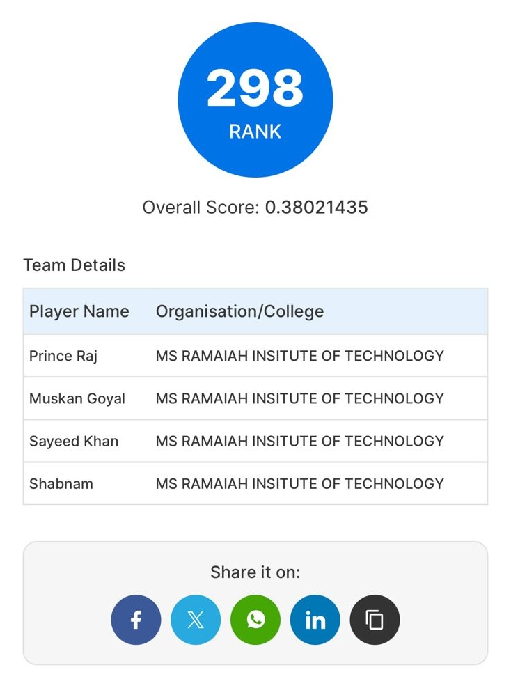

# Amazon ML Challenge 2024 - Feature Extraction from Images

This repository contains the codebase for our participation in the Amazon Machine Learning (ML) Challenge 2024. The challenge focused on developing a machine learning model to extract entity values from product images, such as weight, volume, voltage, wattage, and dimensions.

## Problem Statement

In digital marketplaces, many products lack detailed textual descriptions, making it essential to extract key information directly from images. The goal of this challenge was to create a machine learning model that can extract precise product information from images, including details such as weight, volume, voltage, wattage, and dimensions.

### Data Description:

The dataset provided consists of the following columns:

- `index`: A unique identifier (ID) for the data sample.
- `image_link`: A public URL where the product image can be downloaded. 
  - Example: [Product Image](https://m.media-amazon.com/images/I/61I9XdN6OFL.jpg)
  - To download images, use the `download_images` function from `src/utils.py`. A sample code can be found in `src/test.ipynb`.
- `group_id`: The category code of the product.
- `entity_name`: The product entity name, e.g., `"item_weight"`.
- `entity_value`: The product entity value, e.g., `"34 gram"`.

Note: In `test.csv`, the `entity_value` column is missing, as this is the target variable to be predicted.

### Output Format

The output should be a CSV file with the following format:

- `index`: The unique identifier (ID) of the data sample.
- `prediction`: A string with the format `x unit`, where:
  - `x` is a float number.
  - `unit` is one of the allowed units (provided in the challenge description).
  
Examples of valid predictions:
- `"2 gram"`
- `"12.5 centimetre"`
- `"2.56 ounce"`

### Invalid Predictions:
- `"2 gms"`
- `"60 ounce/1.7 kilogram"`
- `"2.22 kilogram"`

---

## Files in This Repository

- `main.py`: Our core script that predicts entity values from images.
- `dividingdataset.py`: Script for dividing the dataset into chunks to process the data in a cluster of hardware.
- `outputcombine.py`: Combines various output files into a single CSV.
- `outputoverlappingfilter.py`: Filters overlapping predictions.
- `output_predicted.csv`: The final output containing predictions in the required format.
- `test.csv`: The test dataset provided in the competition.

---

## Model Performance

Our our simple code achieved an F1 score of **0.38**.

---

## Final Rank

we secured the following rank in the Amazon ML Challenge 2024:

---